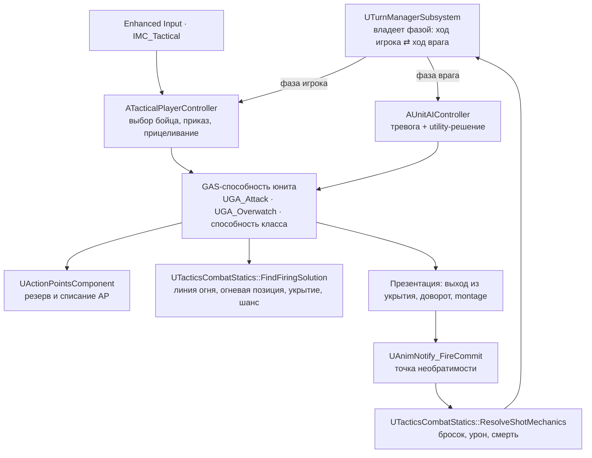

# XRU1 — «Тихий узел»

Прототип пошаговой тактики в духе XCOM 2 на Unreal Engine 5.7: укрытия, очки
действий, наблюдение и отряд из четырёх классов.

| | |
|---|---|
| Движок | Unreal Engine 5.7, C++ и Blueprints |
| Жанр | пошаговая тактика, одиночная; референс — XCOM 2 (Firaxis) |
| Код | ~57 000 строк C++ в `Source/XRU1` (200 файлов) + три игровых плагина в `Plugins/` |
| Контент | 630 собственных ассетов в `Content/XRU1Game` |
| Уровни | меню, хаб и одна боевая карта с двумя сценарными сублевелами |
| Платформа | Windows, standalone |
| Прохождение | расчётные 12–18 минут от главного меню до финального экрана |

## Что это за игра

Демо проходится целиком: главное меню → выбор сложности → интро-ролик → хаб с
голографической картой → обучение на полигоне → боевая миссия «Узел-7» → экран
результата. Отряд из четырёх классов (штурмовик, снайпер, медик, танк) действует
по правилам XCOM: два очка действия на бойца за ход, свободное перемещение по
навмешу в пределах бюджета пути, направленные укрытия Half/Full, наблюдение
(Overwatch) с реакционным выстрелом в фазу противника, туман войны, скрывающий
живого врага вне линии обзора отряда. Обучение — 26 скриптованных шагов с
озвучкой, которые знакомят с каждым классом и его способностью; миссия — задача
с таймером: обезвредить заряд за отведённое число ходов и вывести отряд в зону
эвакуации. Противник — не болванчик: у него собственная модель тревоги
(патруль → расследование шума → бой) и utility-выбор действия, ограниченный тем
же бюджетом AP и той же геометрией линии огня, что и у игрока.

## Как запустить

Потребуется: Windows, **Unreal Engine 5.7** (Epic Games Launcher), **Visual
Studio 2022** с компонентами C++ для игр, **git-lfs** (без него вместо ассетов
приедут текстовые указатели и проект не откроется).

```bash
git lfs install
```

```bash
git clone <адрес репозитория> XRU1
```

Сборка — из корня проекта (скрипт сам найдёт движок по реестру):

```bash
.\Build-XRU1.ps1
```

Затем открыть `XRU1.uproject` двойным кликом. Стартовая карта игры —
`L_MainMenu` (задана в конфиге); нажать Play — и демо идёт от главного меню
до финального экрана. В редакторе по умолчанию открывается боевая карта
`Main_Map_Showreel`.

### Игра с нуля

В главном меню — «Новая игра» (кнопка «Продолжить» активна только при
существующем сохранении). В хабе сначала доступен «Полигон „Купол“» — обучение;
«Станция „Узел-7“» открывается после его прохождения. Кампания лежит в слоте
`TacticsCampaign`; чтобы стартовать с полностью чистого состояния, удалите файл:

```bash
Remove-Item Saved\SaveGames\TacticsCampaign.sav
```

## Управление

| Бой | Действие |
|---|---|
| ЛКМ | выбрать бойца, подтвердить цель, работа с UI |
| ПКМ | приказ перемещения |
| 1–4 / Tab | выбрать бойца / следующий боец с очками действия |
| Пробел | вход и выход из прицеливания; пропуск реплики инструктажа |
| Y | наблюдение (Overwatch) |
| X | глухая оборона |
| R | способность класса |
| F | обезвредить заряд / эвакуация |
| Backspace | пропустить ход бойца |
| Enter | завершить ход |
| Esc | пауза |

| Камера | Действие |
|---|---|
| WASD / курсор у края экрана | панорамирование |
| Q / E | поворот на 45° нажатием, непрерывный — удержанием |
| Колесо мыши | зум и наклон одним движением |
| Alt + мышь | свободный обзор |
| PageUp / PageDown | плоскость обзора на этаж выше/ниже |
| C / V | центр на выбранном бойце / на отряде |
| Home | сброс ракурса |

В режиме прицеливания Q/E листают цели, а не крутят камеру.

## Архитектура

Механическое состояние живёт в C++; Blueprint отображает его, запускает montage,
VFX и звук, но не считает урон, AP, линию огня и исход действия.

| Каталог | Ответственность |
|---|---|
| `Source/XRU1/Tactics/` | ядро: ходы, AP, перемещение, укрытия, линия огня, выстрел, AI, способности, камера, миссия, сейв |
| `Source/XRU1/UI/`, `UI/Menus/` | боевой HUD, виджеты юнитов, стек экранов на CommonUI |
| `Source/XRU1/Audio/` | единая точка воспроизведения, профили юнитов, шаги, музыка |
| `Source/XRU1/FX/` | визуал выстрела и Niagara-эффекты по подтверждённым событиям |
| `Source/XRU1/Subtitles/` | слой субтитров и титры ролика |
| `Source/XRU1/Hub/` | голо-карта хаба и маркеры миссий |
| `Source/XRU1/Characters/` | GAS-иерархия юнита и атрибуты |
| `Source/XRU1/PCG/` | собственные PCG-ноды раскладки окружения |
| `Plugins/STQuestSystem` | квесты и обучение на StateTree, подсказки |
| `Plugins/TeamManager` | фракции: отряд игрока и противник |
| `Plugins/GameplayMessageRouter` | шина сообщений, от которой зависит квест-система |

Основной поток боя — кто владеет ходом, как приходит команда игрока и где
считается выстрел:



До `FireCommit` попадание, урон и трата боезапаса не применяются, поэтому
прерванное действие возвращает AP; после него исход уже не отменяется. Игрок и
AI пользуются одними и теми же предикатами: «нет линии огня» в HUD и
невозможность выстрела у противника — это одна функция, а не две похожие.

Подробное устройство — [docs/03_ARCHITECTURE.md](docs/03_ARCHITECTURE.md),
боевой AI — [docs/04_AI.md](docs/04_AI.md).

## Документация

| Файл | Зачем читать |
|---|---|
| [docs/README.md](docs/README.md) | навигация по документации и состояние проекта |
| [docs/01_GDD.md](docs/01_GDD.md) | правила боя, числа баланса, содержание демо |
| [docs/02_LORE_SCRIPT.md](docs/02_LORE_SCRIPT.md) | лор, персонажи, все игровые тексты и сценарии |
| [docs/03_ARCHITECTURE.md](docs/03_ARCHITECTURE.md) | устройство систем: бой, туман, UI, звук, субтитры |
| [docs/04_AI.md](docs/04_AI.md) | боевой AI: архитектура, отличия от XCOM 2, профили сложности |
| [docs/05_WORKFLOW.md](docs/05_WORKFLOW.md) | сборка, конвенции C++/BP/ассетов, локализация |
| [docs/06_COURSE_HOMEWORK.md](docs/06_COURSE_HOMEWORK.md) | соответствие учебному заданию |
| [MIGRATION_NOTES.md](MIGRATION_NOTES.md) | что перенесено из учебного репозитория, что написано с нуля |