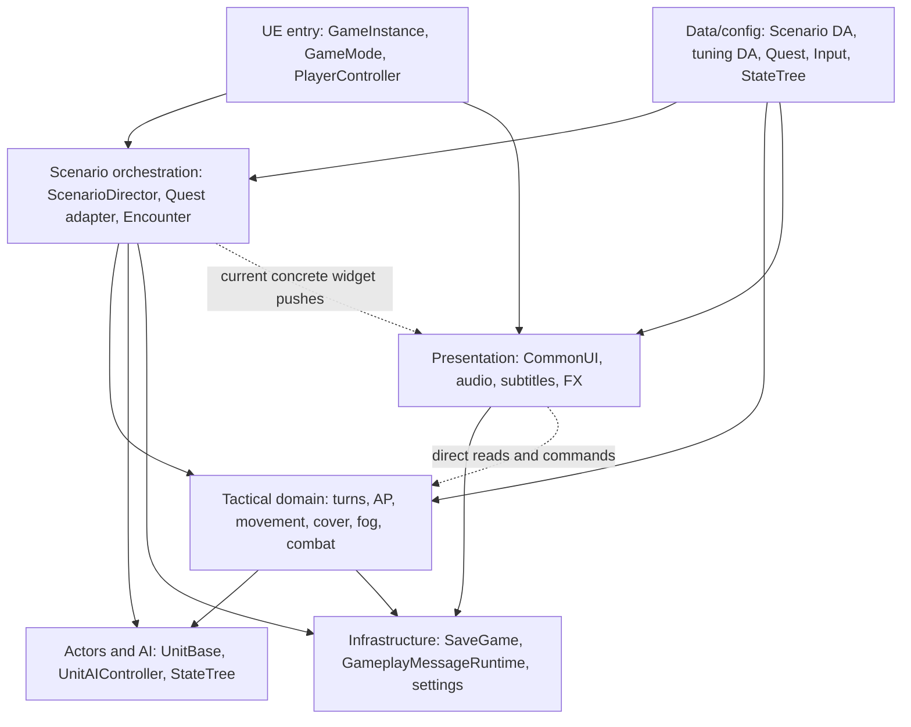
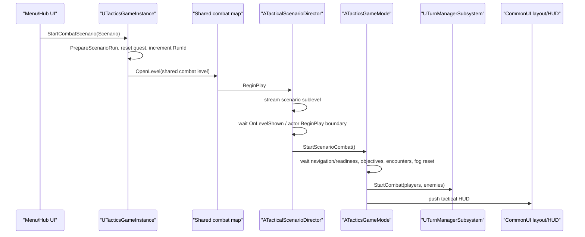
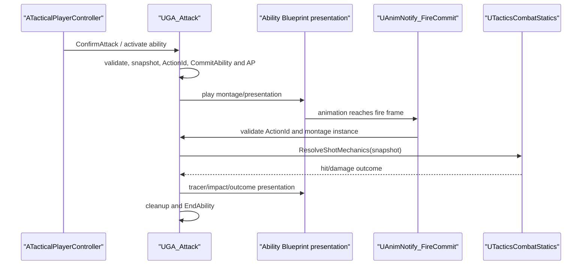
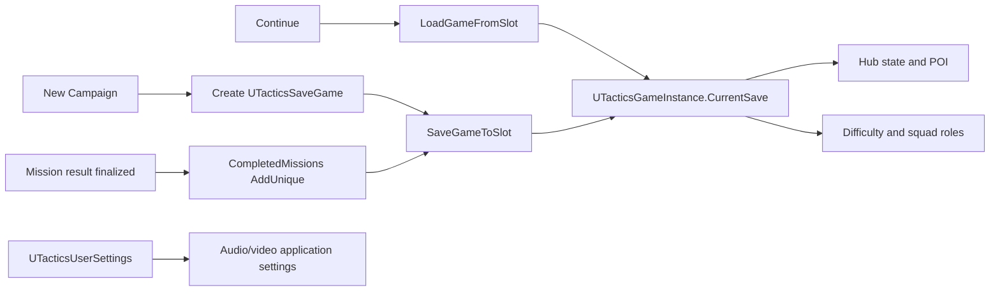

# 02. Текущая архитектура XRU1

Дата среза: 2026-08-04. Анализируемый commit: `c8edbc8027a607f480307eef21359526f2e18654` (`main`).

## 1. Как читать этот документ

Это описание фактически реализованной архитектуры, а не целевой схемы и не пересказ GDD. Для существенных утверждений используется маркировка:

- **Факт** — подтверждён исходным кодом, descriptor/config-файлом, Asset Registry или чтением Blueprint-графа;
- **Вывод** — архитектурная интерпретация нескольких фактов;
- **Гипотеза** — правдоподобный runtime-эффект, который нельзя подтвердить без запуска/профилирования;
- **Неизвестно** — область, для которой в аудите не было достаточной проверки.

Уровни уверенности `High`, `Medium`, `Low` относятся к доказательству, а не к важности проблемы. Риски и рекомендации вынесены в `04_FINDINGS.md`; здесь фиксируется устройство системы.

## 2. Архитектурный диагноз

XRU1 — однопользовательский пошаговый тактический прототип на UE 5.7. Физически почти весь проектный runtime-код собран в одном модуле `XRU1`, но логически внутри него уже различимы механика боя, оркестрация сценария, AI, presentation, данные и инфраструктура. Плагины вынесены физически, однако проект использует их неравномерно: `STQuestSystem` и `GameplayMessageRuntime` являются рабочими runtime-зависимостями, `TeamManager` включён, но прямое использование из C++ XRU1 не обнаружено, `UnrealClaude` — локальный editor-инструмент. **[Факт, High]**

Основной архитектурный рисунок — UE-native composition:

- долговечное межуровневое состояние принадлежит `UGameInstance` и `UGameInstanceSubsystem`;
- боевое состояние конкретного мира принадлежит `UWorldSubsystem`, `AGameModeBase`, director-акторам и unit-компонентам;
- механика выстрела централизована в GAS/`UTacticsCombatStatics`, а Blueprint отвечает преимущественно за presentation;
- настройка осуществляется через Data Assets, soft object references, Blueprint defaults и config;
- UI построен поверх CommonUI, но `ATacticsGameMode` местами напрямую знает конкретные виджеты;
- боевой runtime не проектировался как сетевой: проектные `GameState`/`PlayerState`, replicated gameplay state и RPC не обнаружены; это соответствует принятому single-player scope. **[Факт, High]**

В текущем масштабе один runtime-модуль сам по себе не является дефектом. Реальная граница риска находится не в количестве `.Build.cs`, а в двунаправленных include-зависимостях между папками, крупных orchestration-классах и незафиксированных lifecycle-контрактах. **[Вывод, High]**

## 3. Агрегированный инвентарь

### 3.1. Репозиторий и код

| Объект | Подтверждённый объём | Источник |
|---|---:|---|
| Отслеживаемые файлы | 3 259 | `git ls-files` |
| C++ headers | 229 | расширение `.h` |
| C++ implementations | 211 | расширение `.cpp` |
| C++ files всего | 440 | headers + implementations |
| Код модуля `XRU1` | 210 `.h/.cpp` | `Source/XRU1` |
| Код project plugins | 230 `.h/.cpp` | `Plugins` |
| Project runtime-модули | 4 | `XRU1`, `STQuestSystem`, `GameplayMessageRuntime`, `TeamManager` |
| Project editor/uncooked-модули | 3 | `STQuestSystemEditor`, `GameplayMessageNodes`, `UnrealClaude` |
| Всего C++ модулей в scope | 7 | все `.Build.cs` проекта и project plugins |
| Target-ы | 2 | `XRU1.Target.cs`, `XRU1Editor.Target.cs` |
| Project docs `.md` | 12 | `docs/` на момент аудита |

`XRU1.uproject` объявляет один собственный модуль `XRU1` типа `Runtime`, loading phase `Default` (`XRU1.uproject:6-11`). Game- и Editor-target добавляют один и тот же модуль (`Source/XRU1.Target.cs:10-13`, `Source/XRU1Editor.Target.cs:10-13`). **[Факт, High]**

### 3.2. Content

Asset Registry дал полный ответ для `/Game`: 2 664 package, что совпало с файловым инвентарём 2 622 `.uasset` + 42 `.umap`; суммарный размер на диске около 8,93 GiB. Размер package на диске не равен resident RAM и используется только как инвентарная величина. **[Факт, High]**

| Корень `/Game` | Packages |
|---|---:|
| `US_Military` | 1 743 |
| `XRU1Game` | 620 |
| `MWLandscapeAutoMaterial` | 100 |
| external actors | 86 |
| `NiagaraExamples` | 83 |
| `TopDown` | 31 |
| `Movies` | 1 |

Сводка asset-классов по всему `/Game`:

- 42 `World`;
- 69 `Blueprint`;
- 17 `WidgetBlueprint`;
- 3 `AnimBlueprint`;
- 3 `ControlRigBlueprint`;
- итого 92 Blueprint-family asset;
- 0 redirector;
- 0 `DataTable`.

В `/Game/XRU1Game` находятся 620 packages, 46 Blueprint-family asset и 5 world assets: `L_MainMenu`, `L_Hub`, `Main_Map_Showreel` и два scenario sublevel. Все 46 XRU1 Blueprint были прочитаны Blueprint query: каждый имеет прямого native parent, XRU1 Blueprint-to-Blueprint inheritance chain не обнаружено. **[Факт, High]**

Проектная data/config/control-выборка включает 45 assets: 24 designer data assets в `Data` (включая два `QuestDefinition`/primary assets), 18 `InputAction`, один `InputMappingContext`, два `StateTree`. Кроме них в проекте есть style, material, sound, animation, map и media assets, связанные жёсткими и мягкими ссылками. **[Факт, High]**

### 3.3. Физические области `Source/XRU1`

| Область | Фактическая ответственность | Характер границы |
|---|---|---|
| `Tactics/` | AP, turn loop, cover, fog, combat/GAS, AI, scenario, quest adapters, tutorial, save/settings | главное domain/orchestration ядро, но знает UI/audio/subtitles/characters |
| `UI/` | CommonUI root layout, HUD, menus, combat feedback, objective pointers, widget styles | presentation, но напрямую читает Tactics и Characters |
| `Audio/` | музыка, SFX, voice mix/settings, unit sound data, footsteps | `UGameInstanceSubsystem`, зависит от Tactics/Subtitles/root |
| `Subtitles/` | subtitle tracks, overlay, media/sound drivers, localization settings | presentation service с зависимостями на UI/Tactics/root |
| `Characters/` | перенесённая иерархия character/GAS/attributes/controller | foundation для `AUnitBase`, при этом знает UI/Interaction/Tactics |
| `Hub/` | hub game mode/controller/camera, hologram map, POI markers | отдельный gameplay mode, зависит от Tactics/UI/Audio/root |
| `Interaction/` | интерфейс interactable и detector component | небольшой потенциально reusable seam |
| `PCG/` | scatter jitter и slope/height filter | изолированные authoring/runtime PCG nodes |
| `FX/` | shot tracer и unit VFX data | presentation helper, зависит от root |
| `UI/Editor`, `Tactics/Editor` | authoring libraries для widgets/StateTree | editor-код находится физически в runtime-модуле под `WITH_EDITOR` |
| root `Source/XRU1` | module startup и остаточные Top Down template classes | composition/legacy shell |

Границы папок — соглашение, а не compiler-enforced module boundary. Из 608 локальных include-рёбер 170 пересекают верхнеуровневую папку; найдены двунаправленные пары `UI↔Tactics`, `Tactics↔Audio`, `Tactics↔Subtitles`, `Tactics↔Characters`, `UI↔Subtitles`, `UI↔Hub`. Это **не циклы UE-модулей**. **[Факт, High]**

## 4. Физические UE-модули и плагины

### 4.1. Модули

| Модуль | Тип / phase | `.h/.cpp` | Роль |
|---|---|---:|---|
| `XRU1` | Runtime / Default | 210 | весь project gameplay и presentation |
| `STQuestSystem` | Runtime / Default | 69 | quest/dialogue runtime, UI, rewards, progress store |
| `STQuestSystemEditor` | Editor / PostEngineInit | 10 | factories, validators, debugger/tooling |
| `GameplayMessageRuntime` | Runtime / Default | 6 | gameplay message subsystem и async listener |
| `GameplayMessageNodes` | UncookedOnly / Default | 3 | Blueprint async K2 node |
| `TeamManager` | Runtime / Default | 4 | generic team helper |
| `UnrealClaude` | Editor / PostEngineInit | 138 | MCP/editor automation bridge |

Локальный module graph имеет семь узлов, пять рёбер, ноль циклов и максимальную глубину два. `GameplayMessageRuntime` имеет локальный fan-in 3; `XRU1` — локальный fan-out 2. Подробный граф находится в `03_DEPENDENCY_ANALYSIS.md`. **[Факт, High]**

### 4.2. Project plugins

В scope находятся четыре project plugin:

1. `GameplayMessageRouter` — runtime message bus плюс uncooked Blueprint node;
2. `STQuestSystem` — runtime quest/dialogue framework плюс editor tooling; зависит от `GameplayMessageRouter`;
3. `TeamManager` — runtime team helper; включён в `.uproject`, но прямых C++ include/dependency из `XRU1` не обнаружено;
4. `UnrealClaude` — editor plugin с `EnabledByDefault`, не перечислен отдельной записью в `.uproject`, запускает локальный MCP HTTP server при startup editor-модуля.

В `.uproject` явно включены шесть engine plugins: `ModelingToolsEditorMode`, `StateTree`, `GameplayStateTree`, `GameplayAbilities`, `CommonUI`, `PCG`, а также три из четырёх project plugins: `GameplayMessageRouter`, `TeamManager`, `STQuestSystem` (`XRU1.uproject:13-53`). С транзитивными зависимостями plugin graph содержит 13 plugin-узлов и 8 plugin-to-plugin рёбер; циклов нет. **[Факт, High]**

## 5. Логические слои

Физический модуль один, но текущую систему полезно читать как пять логических слоёв.



Пунктирные рёбра показывают места, где желаемая однонаправленность нарушается, но не утверждают наличие UE module cycle.

### 5.1. Composition и cross-world state

`UTacticsGameInstance` — composition root межуровневого состояния. Он:

- хранит ссылки на HUD/cover/fog/audio/AI tuning data;
- хранит soft references на main menu, hub, shared combat level;
- держит `CurrentSave`, `ActiveScenario` и идентификатор текущего scenario run;
- создаёт/загружает campaign save;
- открывает уровни и подготавливает scenario run (`TacticsGameInstance.cpp:115-175`).

`UGameInstanceSubsystem`-сервисы переживают смену мира:

| Сервис | Ответственность |
|---|---|
| `UTacticsAudioSubsystem` | music/SFX/voice, sound classes/mix, application settings |
| `UXRU1SubtitleSubsystem` | активные subtitle cues, overlay bridge, timers/delegates |
| `UGameUIManagerSubsystem` | weak reference на current `UPrimaryGameLayout`, push layer API |
| `UGamePauseSubsystem` | pause state, input routing/Slate integration |
| `UQuestSubsystem` | quest runtime из `STQuestSystem` |
| `UDialogueSubsystem` | dialogue runtime из `STQuestSystem` |

Такое владение корректно для данных, которые должны пережить `OpenLevel`. При этом любая сохранённая ссылка на world object требует сброса при travel; `GameUIManagerSubsystem` хранит layout через weak world-aware binding и очищает старую root-ссылку (`GameUIManagerSubsystem.cpp:30-81`). **[Факт, High]**

### 5.2. World-scoped tactical state

| Система | Lifetime | Владение/роль |
|---|---|---|
| `UTurnManagerSubsystem` | `UWorldSubsystem` | фаза боя, списки player/enemy units, sequential enemy queue |
| `UFogGridSubsystem` | `UTickableWorldSubsystem` | построение grid, rasterization, visibility data/texture |
| `UFogOfWarSubsystem` | `UTickableWorldSubsystem` | high-level reveal/visibility orchestration |
| `UTacticalAIDirectorSubsystem` | `UWorldSubsystem` | shared AI contacts/reservations/coordination |
| `UTacticalScenarioSubsystem` | `UWorldSubsystem` | registry scenario actors по stable ID |
| `UMissionVoiceDirectorSubsystem` | `UWorldSubsystem` | mission VO sequencing |
| `UTutorialActionGateSubsystem` | `UWorldSubsystem` | разрешение/запрет tutorial actions |
| `UTutorialPresentationSubsystem` | `UWorldSubsystem` | hints/highlights/markers presentation |
| `UObjectivePointerSubsystem` | `UTickableWorldSubsystem` | off-screen/on-screen objective pointers |
| `UCombatFeedbackSubsystem` | `UTickableWorldSubsystem` | damage/combat feedback presentation |

`ATacticsGameMode` — server-authority по терминологии UE, но фактически local single-player world coordinator: запускает combat после readiness, связывает scenario/objectives/encounters, собирает units, стартует `UTurnManagerSubsystem`, финализирует результат, обновляет save и показывает result UI (`TacticsGameMode.cpp:48-126`, `:300-499`, `:604-722`). **[Факт, High]**

`ATacticalScenarioDirector` владеет переходом от загруженной persistent map к активному scenario sublevel: получает `ActiveScenario` из `UTacticsGameInstance`, запрашивает streaming, ждёт `OnLevelShown`, запускает quest, затем `ATacticsGameMode::StartScenarioCombat`; в `EndPlay` снимает delegates, timers и завершает quest runtime (`TacticalScenarioDirector.cpp:25-243`, `:474-518`). **[Факт, High]**

### 5.3. Units, components и GAS

Фактическая иерархия тактического юнита:

```text
ACharacter
└─ ABaseCharacter
   └─ AGASCharacter
      └─ ATDCombatant
         └─ AUnitBase
            ├─ AAssaultUnit
            ├─ ASniperUnit
            ├─ AHealerUnit
            └─ ATankUnit
```

`AGASCharacter`/`ATDCombatant` дают Ability System и attributes; `AUnitBase` добавляет tactical identity/state, selection/visuals, action points, cover/fog/combat integration. Четыре роли реализованы native-классами в `UnitClasses.*`, а designer defaults собираются в пяти unit Blueprint assets, включая базовую/конкретные конфигурации. **[Факт, High]**

Компонентные seams:

- `UActionPointsComponent` — AP budget и расход;
- `UCoverDetectionComponent` — cover probes/evaluation;
- `UFogRevealableComponent` — политика отображения объекта в fog;
- `UScenarioActorIdComponent` — stable identity для scenario registry;
- `UInteractionDetectorComponent` — sphere-based interactable detection;
- GAS `AbilitySystemComponent` и `UTDAttributeSet` — abilities/effects/health/combat attributes.

Боевые abilities наследуются от `UTacticalAbility`; выстрелы проходят через `UGA_Attack`/`UGA_Overwatch`, native gameplay tags и `UTacticsCombatStatics`. Это сильная фактическая граница: hit/damage механика не размазана по Widget Blueprint. **[Факт, High]**

### 5.4. AI

`AUnitAIController` объединяет perception, tactical scoring, action execution, GAS interaction, patrol, pathing, scripted movement, settlement и terminal cleanup. Файл имеет 3 377 строк реализации и 1 180 строк header; аудит выделил около 63 definitions и 39 includes. **[Факт, High]**

AI использует:

- `UAIPerception`/sight и `IGenericTeamAgentInterface`;
- `UTacticalAIDirectorSubsystem` для shared contacts/reservations;
- data-driven `UAIBehaviorProfileDataAsset` по сложности;
- StateTree для высокоуровневого поведения;
- набор instanced `UAIActionEvaluator` для оценки move/attack/overwatch/patrol и pure `ScorePositionFacts`;
- `UTurnManagerSubsystem` для последовательной активации противников.

Семь project automation tests покрывают только pure scoring/evaluator cases в `Tactics/Tests/XRU1AITests.cpp`. Во время аудита suite `XRU1.AI` был реально запущен в открытом editor: после примерно 600 секунд preflight/discovery все 7 тестов завершились `Success`. Это подтверждает только данный узкий набор, а не полный AI lifecycle. **[Факт, High]**

### 5.5. Input и player orchestration

`ATacticalPlayerController` — facade и одновременно крупный coordinator (3 185 строк `.cpp`, 869 строк `.h`, около 97 definitions, 48 includes). В нём сосредоточены:

- BeginPlay/EndPlay, создание root layout и binding delegates (`:81-293`);
- hover, cursor tracing и path preview (`:295-621`);
- tutorial hooks (`:645-1177`);
- selection (`:762-1200`);
- move/attack/ability commands (`:1225-2370`);
- pause (`:2423-2452`);
- camera (`:2456-2724`);
- fog/enemy camera/range/auto-end (`:2725-3185`).

Enhanced Input настроен data-driven: 18 `InputAction` и один `InputMappingContext`; tactical controller добавляет mapping context в `BeginPlay` (`TacticalPlayerController.cpp:219-233`). Hub/menu имеют отдельные player controller классы. **[Факт, High]**

### 5.6. UI, audio, subtitles и FX

CommonUI composition:

- `UPrimaryGameLayout` — root layout/layers;
- `UGameUIManagerSubsystem` — регистрирует current root и предоставляет push API;
- `ATacticalPlayerController::BeginPlay` создаёт root layout (`TacticalPlayerController.cpp:100-106`);
- menu/hub/tactical widgets реализованы нативными bases плюс Widget Blueprint;
- `ATacticsGameMode` напрямую включает и push-ит tactical HUD/result widgets (`TacticsGameMode.cpp:23-25`, `:490-499`, `:707-719`).

Проект содержит 17 Widget Blueprint. `WBP_TacticalHUD` получает состояние через native `UTacticalHUDWidget`, но Blueprint graph напрямую вызывает `Get Alive Enemy Count`, а не visibility-safe API; это фактическое нарушение presentation contract, подробно зафиксированное как `UI-001`. **[Факт, High]**

`UTacticsAudioSubsystem` централизует audio policy и хранит ссылки на `UTacticsAudioSettingsDataAsset`; `UUnitAudioDataAsset` и anim notify дают per-unit footsteps/voice/SFX. `UXRU1SubtitleSubsystem`, `USubtitleTrackDataAsset`, `UMediaSubtitleDriver` и `USoundSubtitleData` дают единый subtitle path для media и sound. `AShotTracerActor` и `UUnitVfxDataAsset` отделяют часть визуальных эффектов от механики выстрела. **[Факт, High]**

### 5.7. Data-driven boundary

Native C++ определяет правила, lifetime и Blueprint API; Blueprint/Data Assets задают композицию и presentation defaults. Подтверждённые ключевые assets:

- `BP_TacticsGameInstance` — hard references на 8 tuning/style DAs и soft references на main menu/hub/showreel;
- `DA_TacticsAudio` — audio mix/classes/music/stingers;
- `GM_Tactics` — camera, player controller, HUD/result classes;
- tactical player controller BP — root layout, move visualizer, input assets, pause screen;
- unit Blueprint — weapon, attack/overwatch abilities, unit HUD, anim BP, montages и role tuning;
- scenario DA — soft sublevel/quest/voice references;
- quest definition — hard StateTree reference;
- tutorial StateTree — soft references на 31 VO assets;
- `DA_TacticalHUDStyle` — icons/portraits и soft fullscreen/media assets.

Все 620 assets в `/Game/XRU1Game` были опрошены на hard/soft dependencies: 1 071 внутреннее ребро, ноль ошибок запроса. Среди 46 XRU1 Blueprint graph найдено 50 BP-to-BP dependency edges и ноль dependency cycles. **[Факт, High]**

Blueprint presentation abilities `BP_GA_Attack` и `BP_GA_Overwatch` содержат близкие latent-графы (115/107 nodes, по 8 variables); механика при этом остаётся native и защищена `ActionId`. Это не дублирование combat rules, а дублирование presentation coordinator. **[Факт + вывод, High/Medium]**

### 5.8. Persistence и settings

`UTacticsSaveGame` хранит:

- difficulty;
- completed mission IDs;
- last hub POI;
- squad roles;
- `bHubBriefed`;
- legacy audio/video settings для чтения старых слотов.

Новые application settings вынесены в `UTacticsUserSettings`. `UTacticsGameInstance` создаёт, загружает и сохраняет campaign slot через `UGameplayStatics::{Create,Load,Save}Game...`, затем применяет user settings (`TacticsGameInstance.cpp:26-71`). Game mode записывает completion после финализации миссии (`TacticsGameMode.cpp:691-715`); hub/audio/menu также вызывают save paths. **[Факт, High]**

Явного `SaveFormatVersion` и migration dispatcher в `TacticsSaveGame.h:19-60` нет. Tagged-property serialization UE смягчает совместимость добавляемых полей, но формального контракта эволюции нет. Возвращаемые результаты операций сохранения в нескольких call sites не обрабатываются пользовательским recovery path; это отражено в `SAVE-001` и `DATA-001`. **[Факт, High]**

### 5.9. Editor tooling и build

Project-specific authoring libraries `XRU1WidgetAuthoringLibrary` и `XRU1StateTreeAuthoringLibrary` лежат в `Source/XRU1/UI/Editor` и `Source/XRU1/Tactics/Editor`. Они защищены `WITH_EDITOR`, а editor-only dependencies добавляются в `XRU1.Build.cs` условно при `Target.bBuildEditor`; доказательств Shipping-link на `UnrealEd` не найдено. Однако `/Script/XRU1` остаётся runtime package для editor helpers, потому отдельного `XRU1Editor` модуля сейчас нет. **[Факт, High]**

`Build-XRU1.ps1` определяет UE 5.7 через registry/path logic и собирает только `XRU1Editor Win64 Development`; при `-StopEditor` он может принудительно завершить editor с явным предупреждением о несохранённых изменениях. Game Target существует, но автоматизированной Game Development/Shipping build, cook/package и clean-machine gate в репозитории нет. `.github/workflows` пуст. **[Факт, High]**

`UnrealClaude` — editor-only bridge. При startup он поднимает HTTP MCP server; во время аудита listener был подтверждён только на `127.0.0.1:3000`. В editor config разрешены auto-approved scripts и remote Python execution для локальной authoring-среды. Это не shipping surface, но это локальная trust boundary редактора. **[Факт, High]**

## 6. Ownership и lifetime

### 6.1. Матрица владения

| Состояние | Фактический owner | Lifetime | Сброс/завершение |
|---|---|---|---|
| campaign/save/settings | `UTacticsGameInstance`, `UTacticsSaveGame`, `UTacticsUserSettings` | process / slot | app shutdown или явная перезапись |
| active scenario + run ID | `UTacticsGameInstance` | между `OpenLevel` | новый `PrepareScenarioRun` |
| quest/dialogue runtime | plugin GI subsystems | между worlds | explicit reset/start при scenario run |
| root UI reference | `UGameUIManagerSubsystem` | между worlds, weak to layout | cleanup при смене layout/world |
| combat phase/unit arrays | `UTurnManagerSubsystem` | world | world teardown / combat completion |
| fog grid/visibility | fog world subsystems | world/scenario | scenario bootstrap/reset |
| scenario actor IDs | `UTacticalScenarioSubsystem` | world | registration/unregistration/world teardown |
| scenario streaming/delegates | `ATacticalScenarioDirector` | actor/world | `EndPlay` cleanup |
| action execution | ability instance + player/AI controller | activation/turn | ability end/watchdog/controller finish |
| AP/cover/fog visibility | unit components | unit actor | actor destruction/world teardown |
| shared AI contacts/reservations | `UTacticalAIDirectorSubsystem` | world | unit unregister/world teardown |
| audio/subtitles | GI subsystems | process, world-aware playback | stop/handle cleanup/travel |

`UTurnManagerSubsystem` хранит unit arrays как GC-visible `TObjectPtr`; AI contacts/reservations используют weak references. Это соответствует различию ownership и observation. **[Факт, High]**

### 6.2. Entry points

1. UE загружает default map и `BP_TacticsGameInstance` по `DefaultEngine.ini:2-5`.
2. `UTacticsGameInstance::Init` применяет сохранённые user settings (`TacticsGameInstance.cpp:20-23`).
3. Map-specific GameMode/PlayerController создают menu, hub или tactical composition.
4. Для scenario `UTacticsGameInstance::StartCombatScenario` фиксирует run и открывает shared combat map.
5. `ATacticalScenarioDirector::BeginPlay` подхватывает scenario и начинает streaming.
6. `ATacticsGameMode::StartScenarioCombat` запускается только после readiness sublevel/actors, затем стартует turn manager и UI.

### 6.3. Shutdown/travel

Подтверждённые cleanup paths:

- `ATacticalScenarioDirector::EndPlay` очищает timer/delegate/quest bindings (`:474-518`);
- `ATacticalPlayerController::EndPlay` очищает часть delegates и transient presentation (`:172-216`);
- `UGameUIManagerSubsystem` отбрасывает старый root layout (`:30-81`);
- subtitle subsystem очищает delegates/timers/world overlay;
- attack/overwatch abilities используют watchdog/teardown;
- pause state очищается перед travel.

Не все bindings симметрично сняты: Enhanced Input mapping context не удаляется, часть selected-unit/gate delegate cleanup отсутствует, а у `AUnitAIController` нет собственного `EndPlay`/`OnUnPossess` cleanup. Это lifecycle debt низкой/средней тяжести, а не доказанная утечка. **[Факт + вывод, High/Medium]**

## 7. Критические runtime-потоки

### 7.1. Запуск сценария



Фактический happy path подтверждён `TacticsGameInstance.cpp:115-158`, `TacticalScenarioDirector.cpp:25-243`, `TacticsGameMode.cpp:98-499`. Readiness work выполняется синхронно до показа HUD; отдельный loading/readiness overlay отсутствует (`docs/04_BACKLOG.md:55-69`). **[Факт, High]**

### 7.2. Ход и enemy activation

`UTurnManagerSubsystem` хранит фазу, player/enemy lists и sequential enemy index. Для каждого enemy он подписывается на completion callback, вызывает controller activation и продвигает очередь только через `HandleEnemyUnitFinished` (`TurnManagerSubsystem.cpp:493-529`). Player phase управляется commands/controller и AP; enemy phase — один AI за другим. **[Факт, High]**

Это простая и понятная модель для прототипа, но у текущего ожидания нет activation token/watchdog. Если current enemy исчезает или деактивируется без callback, runtime может зависнуть; static evidence подтверждает алгоритмический gap, фактическое воспроизведение не выполнялось (`TURN-001`). **[Вывод, Medium]**

### 7.3. Перемещение

Player controller валидирует маршрут и списывает AP до завершения движения (`TacticalPlayerController.cpp:1607-1615`). `AUnitAIController::OnMoveCompleted` обрабатывает segments, после чего `TryFinalizeMovement` публикует `Movement.Settled` и списывает AI AP (`UnitAIController.cpp:2854-3030`). В текущем коде failed/aborted final path проходит в тот же settlement path, а итоговый `FPathFollowingResult` не сохраняется в transaction context. Это `MOVE-001`. **[Факт, High]**

### 7.4. Выстрел



Evidence: `TacticalPlayerController.cpp:2122-2139`, `GA_Attack.cpp:200-351`, `:545-684`, `AnimNotify_FireCommit.cpp:154-209`, `TacticsCombatStatics.cpp:243-329`. Snapshot создаётся до AP commit; `ActionId` защищает от stale notify; ability watchdog/teardown закрывает latent path. Это одна из самых сильных архитектурных частей проекта. **[Факт, High]**

### 7.5. Retry

Нормальный UI-путь доступен из `UMissionResultWidget`: `RestartActiveScenario()` вызывает `StartCombatScenario(ActiveScenario)`, который снова выполняет `PrepareScenarioRun` и `OpenLevel` (`MissionResultWidget.cpp:178-191`, `TacticsGameInstance.cpp:144-175`). Result UI появляется после terminal finalization GameMode, поэтому штатный retry идёт после завершения боя. **[Факт, High]**

Сам `RestartActiveScenario` остаётся `BlueprintCallable` и не проверяет terminal phase; quest events читают текущий GI `RunId` в момент публикации, а не captured generation. Поэтому вызов вне штатного UI flow может смешать старый async callback с новым run. В аудите этот сценарий не воспроизводился; наличие отсутствующего guard — факт, stale callback effect — гипотеза (`RUN-001`).

### 7.6. Save/load



Campaign progress и application settings разведены — legacy settings поля оставлены для чтения старых save. Слабое место — callers часто игнорируют `bool`/null result и не формируют recovery/notification path (`SAVE-001`); формальной версии save schema нет (`DATA-001`). **[Факт, High]**

## 8. C++ / Blueprint / asset boundary

| Решение | Где живёт сейчас | Оценка фактической границы |
|---|---|---|
| AP, cover, hit/damage, turn sequencing | native C++ | корректно централизовано |
| attack/overwatch presentation timing | BP ability + anim montage/notify | допустимо; защищено `ActionId`, но два графа дублируются |
| unit tuning/composition | native defaults + unit BP/data assets | data-driven |
| AI weights | `UAIBehaviorProfileDataAsset` | data-driven |
| scenario map/quest/voice | `UTacticalScenarioDataAsset` soft refs | data-driven, но требует cook contract |
| quest flow | plugin runtime + QuestDefinition/StateTree | смешанный C++/asset workflow |
| UI hierarchy/styles | native widget bases + WBP + style DAs | типичный UE presentation boundary |
| hidden-information policy | native safe API существует, WBP обошёл его | нарушение boundary (`UI-001`) |
| level composition | maps/sublevels | asset-authoring critical path |

Blueprint query не обнаружил connected execution от 39 найденных `Event Tick` nodes, `GetAllActorsOfClass`, `Delay`, `OpenLevel`, `LoadAsset` или cast chains; найдено лишь 7 dynamic casts. Это снижает риск Blueprint-side hidden orchestration, но не доказывает отсутствие latent behaviour в StateTree/material/animation assets. **[Факт, High]**

## 9. Сеть и authoritative state

XRU1 сознательно single-player:

- нет project-specific `AGameStateBase`/`APlayerState`;
- нет найденных project gameplay RPC/replicated property patterns;
- `ATacticsGameMode` и local subsystems являются достаточным authority для текущего scope;
- GDD явно исключает multiplayer (`docs/01_GDD.md:588-598`).

`STQuestSystem` содержит `ReplicatedProgressStore`/FastArray seam, но это возможность плагина, а не доказательство сетевого XRU1 flow. Нельзя выводить из наличия этого класса готовность проекта к multiplayer. **[Факт, High]**

## 10. Что в текущей архитектуре уже хорошо

1. UE module/plugin graph ацикличен; editor modules зависят от runtime, обратных рёбер нет.
2. Combat mechanics проходят через native GAS/`UTacticsCombatStatics`, а animation notify валидирует `ActionId`.
3. Scenario director имеет явную generation/readiness orchestration и cleanup в `EndPlay`.
4. World и cross-world state в основном разделены по корректным UE lifetime scopes.
5. `UGameUIManagerSubsystem` использует weak world-aware root layout reference.
6. Audio/subtitle services централизованы, pause очищается перед travel.
7. XRU1 Blueprint inheritance плоский; dependency cycles и redirectors в project content не найдены.
8. AI scoring имеет pure seam и семь реально проходящих automation tests.
9. No-networking — осознанное ограничение, а не случайно недоделанная replication layer.

## 11. Честные границы этого описания

Не проверялись packaged executable, Shipping/cook, clean-machine install, multiplayer и platform-specific paths. Не снимались Unreal Insights, resident memory, cold I/O trace и frame-time profile. Asset Registry показывает serialized dependencies, но не доказывает runtime residency/streaming flags и dynamic-created references. Blueprint query охватил все 46 XRU1 Blueprint, но не выполнял семантический разбор StateTree, material, animation и Control Rig graphs. Поэтому runtime-performance и release-failure утверждения в других отчётах сформулированы как гипотеза/неизвестно, где это необходимо.
