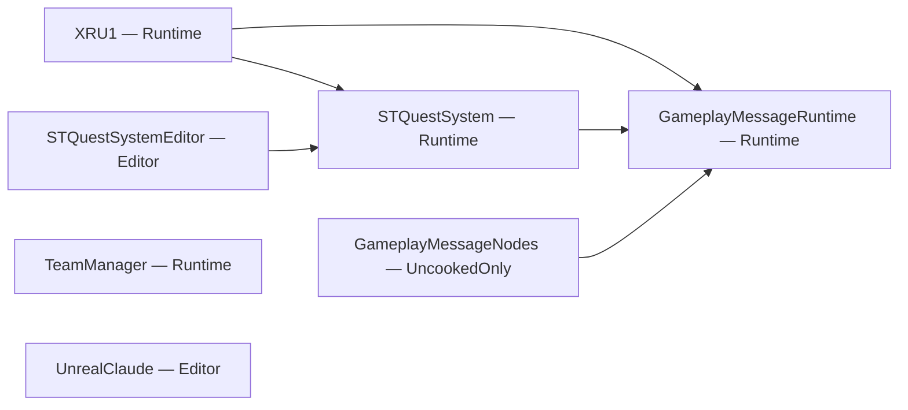
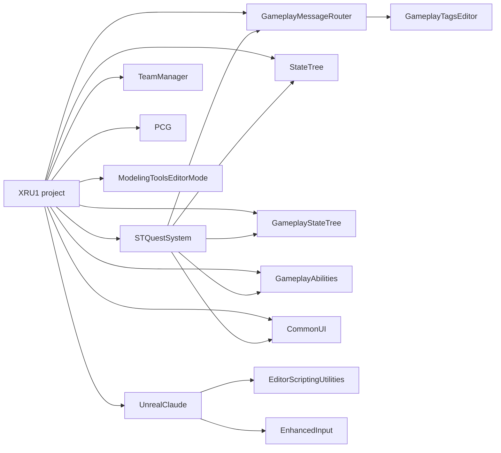

# 03. Анализ зависимостей XRU1

Дата среза: 2026-08-04. Commit: `c8edbc8027a607f480307eef21359526f2e18654`.

## 1. Модель анализа

В Unreal-проекте слово «зависимость» обозначает разные графы. Смешивание этих графов даёт ложные выводы, поэтому аудит разделяет четыре уровня:

1. **UE module graph** — декларации `.Build.cs` и фактические cross-module includes;
2. **plugin graph** — `.uproject` и `.uplugin`;
3. **внутримодульный include graph** — связи областей внутри единственного runtime-модуля `XRU1`;
4. **asset graph** — hard/soft package dependencies из Asset Registry и Blueprint query.

Дополнительно использован semantic code graph как поисковый индекс. Он не считается источником истины для UE module boundaries: одинаковые имена методов (`Get`, `IsValid` и т. п.) создают ложные semantic/call edges.

## 2. UE module graph

### 2.1. Полный список модулей

Проверены `XRU1.uproject`, два `Target.cs`, семь `.Build.cs` и четыре `.uplugin`.

| Модуль | Descriptor type / phase | `.h/.cpp` | Public deps | Private deps | Локальные зависимости |
|---|---|---:|---:|---:|---|
| `XRU1` | Runtime / Default | 210 | 26 | 4 editor-only | `STQuestSystem`, `GameplayMessageRuntime` |
| `STQuestSystem` | Runtime / Default | 69 | 13 | 0 | `GameplayMessageRuntime` |
| `STQuestSystemEditor` | Editor / PostEngineInit | 10 | 3 | 11 | `STQuestSystem` |
| `GameplayMessageRuntime` | Runtime / Default | 6 | 3 | 1 | — |
| `GameplayMessageNodes` | UncookedOnly / Default | 3 | 1 | 7 | `GameplayMessageRuntime` |
| `TeamManager` | Runtime / Default | 4 | 1 | 5 | — |
| `UnrealClaude` | Editor / PostEngineInit | 138 | 12 | 20 | — |
| **Всего** |  | **440** | **59** | **48** | **5 локальных рёбер** |

Количество dependencies в таблице — количество записей module name в соответствующих `.Build.cs`, а не количество include statements.

### 2.2. Надёжный локальный граф



Метрики:

- узлов: 7;
- локальных directed edges: 5;
- циклов: 0;
- максимальная глубина: 2;
- максимальный локальный fan-in: `GameplayMessageRuntime` = 3;
- максимальный локальный fan-out: `XRU1` = 2;
- runtime не зависит от editor/uncooked-модулей;
- editor/uncooked зависят от runtime в правильном направлении.

Это положительный результат. В частности, двунаправленные связи папок внутри `XRU1`, описанные ниже, **не являются UE module cycle** и не должны представляться как build-graph cycle. **[Факт, High]**

### 2.3. Фактические cross-module includes

Прямой include scan подтвердил использование локальных рёбер:

| Ребро | Найдено include statements |
|---|---:|
| `XRU1 → STQuestSystem` | 13 |
| `XRU1 → GameplayMessageRuntime` | 3 |
| `STQuestSystem → GameplayMessageRuntime` | 2 |
| `STQuestSystemEditor → STQuestSystem` | 7 |
| `GameplayMessageNodes → GameplayMessageRuntime` | 1 |

`XRU1` не объявляет и не включает `TeamManager`. Сам проект использует `AIModule`/`IGenericTeamAgentInterface` для отношений команд. Asset-level использование `TeamManager` в полном third-party content не доказано, поэтому текущий статус — «включённый plugin, прямое project C++ использование не найдено», а не «точно не используется нигде». **[Факт + неизвестно, High]**

### 2.4. `XRU1.Build.cs`

Все 26 runtime dependencies объявлены `Public` (`Source/XRU1/XRU1.Build.cs:11-50`):

```text
Core, CoreUObject, Engine, InputCore, EnhancedInput, AIModule,
NavigationSystem, PhysicsCore, StateTreeModule, GameplayStateTreeModule,
Niagara, UMG, Slate, SlateCore, GameplayAbilities, GameplayTags,
GameplayTasks, STQuestSystem, GameplayMessageRuntime, CommonUI,
CommonInput, MediaAssets, AudioMixer, DeveloperSettings, PCG,
ProceduralMeshComponent
```

Обычный private list пуст (`XRU1.Build.cs:52`). Для editor target условно добавляются `UnrealEd`, `UMGEditor`, `StateTreeEditorModule`, `AssetRegistry` (`:60-69`). В `PublicIncludePaths` опубликованы root и десять project folders (`:72-84`). **[Факт, High]**

Архитектурное следствие: поскольку `XRU1` — один runtime-модуль и headers разложены рядом с implementations, Build.cs экспортирует фактически всё. Компилятор не контролирует желаемые domain/presentation boundaries; любой project header может включить другой через широкие include paths. Перевести зависимости в `Private` без одновременной нормализации `Public`/`Private` layout нельзя механически, но текущий all-public контракт увеличивает compile surface и скрывает transitive include ошибки. **[Вывод, High]**

### 2.5. Декларации, которые проходят транзитивно

Direct source verification выявил следующие contract mismatches. Аудит не утверждает, что текущий Editor build падает: имеющийся build проходит благодаря транзитивным зависимостям/unity/shared PCH. Риск проявится при non-unity, изменении engine/plugin transitives или выделении модуля.

| Модуль | Фактическое использование | Декларация | Проблема |
|---|---|---|---|
| `XRU1` | `#include "RHI.h"`, `FUpdateTextureRegion2D` (`FogGridSubsystem.cpp:21`, `:944`) | `RHI` отсутствует | missing direct dependency |
| `UnrealClaude` | `LevelEditor` include/API (`UnrealClaudeModule.cpp:14`, `:136`) | `LevelEditor` отсутствует | missing direct dependency |
| `UnrealClaude` | public `UnrealClaudeSettings.h` включает `DeveloperSettings`; public `ScriptTypes.h` включает JSON (`:6`) | modules объявлены private | public-header contract mismatch |
| `TeamManager` | public `PlayerControllerTeams.h` включает `Engine`/`APlayerController` | `Engine` private | public-header contract mismatch |
| `GameplayMessageRuntime` | public header включает `CoreUObject` types | `CoreUObject` private | public-header contract mismatch |

Это finding `MOD-001`: исправление следует проверять explicit/shared PCH off и non-unity build, иначе cleanup может оказаться косметическим. **[Факт, High]**

### 2.6. Editor code внутри runtime-модуля

`UI/Editor/XRU1WidgetAuthoringLibrary.*` и `Tactics/Editor/XRU1StateTreeAuthoringLibrary.*` физически входят в `XRU1`, но implementation/header guards и условные editor dependencies не дали доказательств Shipping-link на `UnrealEd`. Текущая проблема — boundary и compile hygiene, а не подтверждённый release blocker. **[Факт, High]**

Минимальная целевая мера — отдельный `XRU1Editor` модуль при сохранении одного `XRU1` runtime-модуля. Немедленное дробление runtime на множество modules critic признал переусложнением для текущего prototype scale. **[Reviewer verdict, High]**

## 3. Plugin graph

### 3.1. Явные и транзитивные плагины

`.uproject` явно включает:

- engine: `ModelingToolsEditorMode`, `StateTree`, `GameplayStateTree`, `GameplayAbilities`, `CommonUI`, `PCG`;
- project: `GameplayMessageRouter`, `TeamManager`, `STQuestSystem`.

`UnrealClaude` имеет `EnabledByDefault: true`, поэтому также входит в editor environment без отдельной записи `.uproject`.

Plugin-to-plugin edges:



Метрики plugin graph:

- 13 уникальных plugin-узлов в closure;
- 8 plugin-to-plugin edges;
- 18 edges с учётом project enable/default enable;
- максимальная глубина от project root: 3;
- циклов: 0;
- самая длинная project chain: `XRU1 project → STQuestSystem → GameplayMessageRouter → GameplayTagsEditor`.

`EditorScriptingUtilities` у `UnrealClaude` помечен optional; это свойство сохранено в интерпретации графа. **[Факт, High]**

### 3.2. Коэффициент использования plugin API

`XRU1` включает 6 из 36 public headers `STQuestSystem`. Плагин при этом объединяет quest core, dialogue, CommonUI widgets, GAS rewards и replicated progress store в одном runtime-модуле с 13 all-public dependencies. Это coarse-grained dependency, но не основание немедленно делить плагин: реальный выигрыш build time/reuse не измерен. **[Факт + вывод, Medium]**

`GameplayMessageRuntime` используется как event seam для quest/tutorial integration. `TeamManager` не имеет прямого C++ edge из XRU1. `UnrealClaude` — editor-only tool и не принадлежит shipping dependency graph. **[Факт, High]**

## 4. Внутримодульный include graph `Source/XRU1`

### 4.1. Метод

Для каждого `.h/.cpp` под `Source/XRU1` прочитаны quoted `#include` directives. Include разрешался в локальный project file по относительному пути либо по уникальному basename. Source и target агрегировались по первой папке; файлы непосредственно в `Source/XRU1` отнесены к `Root`.

Результат воспроизводим direct scan:

- локальных include edges: **608**;
- cross-top-folder edges: **170**;
- доля cross-folder: **28,0%**;
- directed area pairs: **27**.

Generated/system angle-bracket includes в эту метрику не входят. Это счётчик include statements, не unique file pairs и не runtime calls.

### 4.2. Все directed area pairs

| Source area → target area | Includes |
|---|---:|
| `UI → Tactics` | 46 |
| `Tactics → Root` | 29 |
| `Tactics → Audio` | 13 |
| `Tactics → UI` | 12 |
| `UI → Root` | 7 |
| `Tactics → Subtitles` | 6 |
| `Audio → Tactics` | 5 |
| `Characters → UI` | 5 |
| `Tactics → Characters` | 5 |
| `UI → Audio` | 5 |
| `Hub → Tactics` | 4 |
| `Hub → UI` | 4 |
| `UI → Subtitles` | 4 |
| `Hub → Audio` | 3 |
| `Subtitles → UI` | 3 |
| `Tactics → FX` | 3 |
| `UI → Characters` | 3 |
| `Hub → Root` | 2 |
| `Subtitles → Root` | 2 |
| `Subtitles → Tactics` | 2 |
| `Audio → Root` | 1 |
| `Audio → Subtitles` | 1 |
| `Characters → Interaction` | 1 |
| `Characters → Tactics` | 1 |
| `FX → Root` | 1 |
| `UI → Hub` | 1 |
| `UI → Interaction` | 1 |
| **Итого** | **170** |

### 4.3. Двунаправленные пары

Шесть area pairs имеют рёбра в обе стороны:

| Pair | Прямое направление | Обратное направление | Пример |
|---|---:|---:|---|
| `UI ↔ Tactics` | `UI→Tactics` 46 | `Tactics→UI` 12 | `APPipsWidget.cpp → ActionPointsComponent.h`; `MissionPointOfInterest.cpp → POIPopupWidget.h` |
| `Tactics ↔ Audio` | 13 | 5 | `GamePauseSubsystem.cpp → TacticsAudioSubsystem.h`; `AnimNotify_UnitFootstep.cpp → UnitBase.h` |
| `Tactics ↔ Subtitles` | 6 | 2 | tactical voice/tutorial code ↔ subtitle services |
| `Tactics ↔ Characters` | 5 | 1 | Unit foundation/tactical specialization |
| `UI ↔ Subtitles` | 4 | 3 | overlay/style/layout integration |
| `UI ↔ Hub` | 1 | 4 | hub widgets/controller composition |

Дополнительный concrete edge: `HealthBarWidget.cpp → Characters/TDAttributeSet.h`; `CSTPlayerController.cpp → UI/GameUIManagerSubsystem.h`. **[Факт, High]**

Эти циклы означают, что папки не могут быть механически превращены в UE modules. Они **не означают**, что UBT module graph цикличен: весь набор компилируется внутри одного модуля. Архитектурный риск — отсутствие enforceable direction и высокая стоимость будущего extraction (`DEP-001`), severity после critic review — `Medium`, не `High/Critical`. **[Reviewer verdict, High]**

### 4.4. Interpretation

Главное ребро `UI→Tactics` ожидаемо для presentation, читающего view state. Более проблемны `Tactics→UI` и `Tactics→Audio/Subtitles`: domain/orchestration включает конкретный presentation API. Однако часть `Tactics` фактически является composition/application layer (`GameMode`, `PlayerController`, tutorial presentation), поэтому считать все 31 обратное include нарушением domain purity было бы неверно. Перед module split нужно сначала классифицировать классы, ввести contracts/read models/commands и automated forbidden-include rules. **[Вывод, High]**

## 5. Semantic code graph

### 5.1. Инвентарные метрики

После fast re-index локальный `codebase-memory` граф содержал:

| Metric | Repository graph | Scoped `Source/XRU1` |
|---|---:|---:|
| Nodes | 5 869 | 2 478 |
| Edges | 21 668 | 9 040 |
| `CALLS` | 6 351 | 2 875 |
| `USAGE` | 5 074 | 1 984 |
| `IMPORTS` | 865 | 419 |

Полный node mix: `Method` 2 520, `Section` 602, `Field` 595, `Class` 554, `Variable` 390, `Function` 377, `File` 363, tool-labelled `Module` 363, `Folder` 63, `Enum` 20, `Macro` 20. Здесь tool-labelled `Module` фактически соответствует parser/file grouping и **не равен** UE module из `.Build.cs`.

### 5.2. Ограничения

Semantic graph использован только для поиска кандидатов и cross-check:

- boundary report ошибочно связывал `XRU1` и `UnrealClaude` через неоднозначные методы `Get`, `IsValid` и подобные имена;
- complexity values были преимущественно нулевыми/неправдоподобными и не использованы в performance findings;
- branch/commit metadata после fast re-index оставался stale относительно текущего `c8edbc8`;
- `.cbmignore:17-24` исключает `Content`, `.uasset`, `.umap`, `Binaries`, `Intermediate`, поэтому asset architecture этим графом не покрывается.

Следовательно, module/plugin результаты выше получены из descriptor/include scan, а line evidence — прямым чтением файлов. **[Факт, High]**

## 6. Asset dependency graph

### 6.1. Покрытие

Asset Registry проинвентаризировал все 2 664 `/Game` packages. Детальный hard/soft dependency query выполнен для всех 620 packages `/Game/XRU1Game`: 1 071 internal dependency edges, 0 query failures. Все 46 XRU1 Blueprint прочитаны по parent/graphs/nodes. **[Факт, High]**

Ограничение: полный dependency closure всех 2 044 third-party packages вне `/Game/XRU1Game` не строился; Engine/Script dependencies фильтровались инструментом; runtime-created references и точные streaming/load flags этим методом не видны.

### 6.2. Blueprint graph

| Metric | Значение |
|---|---:|
| XRU1 Blueprint-family assets | 46 |
| BP-to-BP dependency edges | 50 |
| BP dependency cycles | 0 |
| XRU1 BP inheritance chains | 0 |
| Direct native parent | 46 / 46 |
| Connected Event Tick exec paths | 0 из 39 найденных tick nodes |
| Dynamic casts | 7, chains не обнаружены |

Blueprint graph не содержит найденных `GetAllActorsOfClass`, `Delay`, `OpenLevel` или `LoadAsset`. Это положительный signal о том, что orchestration остаётся в C++, но не заменяет runtime test. **[Факт, High]**

### 6.3. Composition hubs

Подтверждённые ключевые dependency closures:

1. `DefaultEngine.ini:2-5` выбирает `L_MainMenu`, `GM_Tactics` и `BP_TacticsGameInstance`.
2. `BP_TacticsGameInstance` hard-зависит от восьми data assets: HUD style, cover, audio, tutorial, fog, AI Easy/Medium/Hard; soft-зависит от main menu, hub и showreel world.
3. `DA_TacticsAudio` hard-зависит от 21 package, включая пять SoundClass/mix assets и пять music/stinger SoundWave.
4. `GM_Tactics` hard-зависит от tactical camera BP, tactical player controller, `WBP_TacticalHUD`, `WBP_MissionResult`.
5. Tactical player controller asset имеет 22 hard dependencies: root layout, move visualizer, 18 input assets/IMC и pause WBP.
6. Каждый из пяти unit Blueprint имеет 16–18 hard dependencies: weapon, `BP_GA_Attack`, `BP_GA_Overwatch`, `WBP_UnitHUD`, `ABP_Solider`, montages, data assets и materials.
7. Scenario DA soft-зависит от sublevel, quest и voice asset; quest hard-зависит от StateTree; tutorial StateTree soft-зависит от 31 VO asset.
8. `Main_Map_Showreel` имеет 172 hard dependencies (170 из `US_Military`) и 29 soft dependencies: 26 donor lighting/showreel sublevels, два scenario sublevels и scenario DA.
9. `DA_TacticalHUDStyle` имеет 29 hard dependencies на icons/portraits и 12 soft dependencies на fullscreen art, intro media/material, defuse/subtitle resources.

### 6.4. Fan-out hubs

| Asset | Подтверждённый fan-out |
|---|---:|
| `ABP_Solider` | 42 |
| `DA_TacticalHUDStyle` | 40 internal, 41 с `/Game/Movies` |
| tutorial StateTree | 31 soft VO refs |
| tactical player controller asset | 22 |
| `DA_TacticsAudio` | 21 |

`BP_GA_Attack`, `BP_GA_Overwatch`, `WBP_UnitHUD` и `M_SelectionRing` имеют fan-in по пять unit compositions. Это повторно используемые presentation hubs внутри проекта, не отдельные framework modules.

### 6.5. Fan-in hubs

| Asset | Подтверждённый fan-in |
|---|---:|
| `SK_Mannequin` | 113 |
| `SC_Voice` | 49 |
| `SKM_Manny_Simple` | 45 |
| `M_Gun_Base` | 33 |
| `SKM_Quinn_Simple` | 28 |

Высокий fan-in сам по себе не является дефектом: skeleton, sound class и base material должны быть shared hubs. Он указывает на impact radius изменения/удаления и приоритет redirector/reference validation.

### 6.6. Strongly connected components

В XRU1 hard+soft asset graph найдено восемь SCC. Все просмотренные SCC соответствуют ожидаемым mesh↔skeleton/preview или SoundClass parent/children relationships. После ограничения hard-only остаются ожидаемые SoundClass связи. Подозрительных logic/Blueprint/DataAsset cycles в 620 XRU1 packages не обнаружено. Это заключение не распространяется на все third-party packages. **[Факт, High]**

### 6.7. Startup closure и load topology

Жёсткая цепочка `BP_TacticsGameInstance → DA_TacticsAudio → music/stingers` формирует startup closure 59 packages / около 82,25 MiB на диске; пять музыкальных/stinger waves составляют около 75,17 MiB (`combat` 29,22; `hub` 21,42; `menu` 20,87; `victory` 2,09; `defeat` 1,58 MiB). Это доказанный disk/package closure, но не доказанная одновременная resident memory стоимость. **[Факт, High]**

В C++ найдено 23 `LoadSynchronous` call sites и ни одного фактического `RequestAsyncLoad`/`FStreamableManager` flow. Часть synchronous load находится в scenario/menu/tutorial/mission voice first-use paths. Без packaged cold trace нельзя утверждать hitch; critic оставил `LOAD-001` как `Medium` hypothesis и прямо отклонил «переписать всё async» без профиля. **[Факт + гипотеза, High/Medium]**

### 6.8. Maps и streaming dependencies

`Main_Map_Showreel` сохраняет ссылки на 26 donor/showreel sublevels плюс два scenario sublevels. Факт ссылок подтверждён Asset Registry; фактические `ShouldBeLoaded/Visible`, cook inclusion и runtime residency из dependency edge не следуют. Поэтому bloat/load effect — вывод, требующий map streaming audit/package trace. **[Факт + неизвестно, High]**

## 7. Dependency-risk summary

| Finding | Что доказано | Что не доказано | Reviewer calibration |
|---|---|---|---|
| `MOD-001` | direct dependency/public-header mismatches, all-Public surface и editor helpers в runtime | текущий build failure | `Medium`, High confidence |
| `DEP-001` | 170 cross-folder includes, 6 bidirectional pairs | UE module cycle или необходимость немедленного runtime split | `Medium`, High confidence |
| `LOAD-001` | hard startup closure, 23 sync loads, нет async flow | packaged cold hitch/RAM residency | `Medium`, hypothesis until trace |
| `REL-001` | нет automated Game/cook/package/CI gate | фактический cook failure | `Medium`, process risk |
| `SEC-001` | editor MCP/script trust surface | shipping exposure | `Medium`; editor/local only |

## 8. Практический вывод

Текущий физический graph достаточно прост: UE modules и plugins ацикличны. Главная архитектурная стоимость находится внутри `XRU1`: компилятор не видит логических границ, а include direction смешивает domain, orchestration и presentation. Рациональный следующий шаг — не big-bang module split, а:

1. исправить direct dependency declarations и проверить non-unity;
2. вынести только editor authoring code в `XRU1Editor`;
3. зафиксировать forbidden include directions и narrow contracts;
4. сначала разделить крупные controller responsibilities на collaborators внутри модуля;
5. измерить build/runtime/load impact и лишь затем решать, нужен ли runtime module split.

Такой порядок согласуется с независимым critic review: целевой минимальный вариант сохранён, немедленное дробление runtime признано overengineering для текущего prototype scale.
