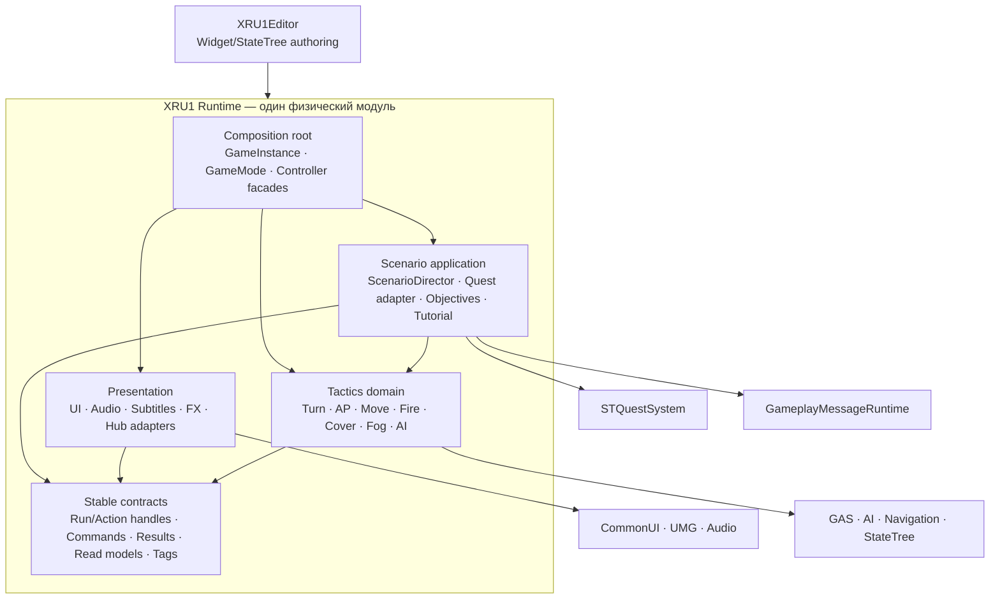
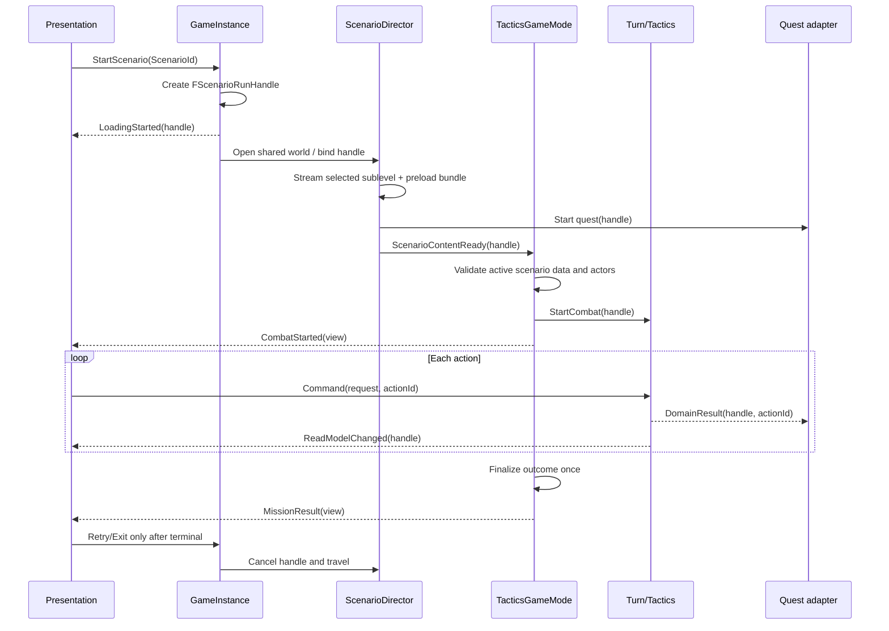
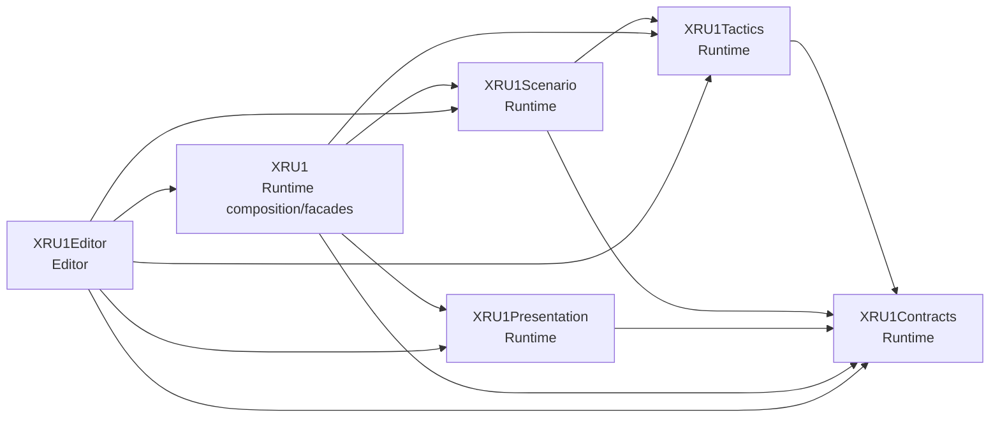

# Целевая архитектура XRU1

Дата решения: 2026-08-04. Рекомендуется **вариант A: один runtime-модуль `XRU1`, отдельный editor-модуль `XRU1Editor` и проверяемые логические контракты внутри runtime**. Вариант B — опциональная физическая декомпозиция после появления измеримых триггеров, а не текущая цель.

Решение учитывает фактический scope: multiplayer и более одной общей боевой карты прямо исключены (`docs/01_GDD.md:588-598`), а ближайший критерий успеха — законченный проход и упакованный build (`docs/06_COURSE_HOMEWORK.md:157-173`). Поэтому истинность action-событий, liveness хода и release pipeline ценнее «идеального» module graph.

## Архитектурные принципы

1. **Сначала истинные транзакции, затем границы.** Физическое перемещение файлов не исправит ложный `Movement.Settled` или зависший enemy turn.
2. **UE-классы остаются стабильными фасадами.** `ATacticalPlayerController`, `AUnitAIController`, `ATacticsGameMode` и существующие Blueprint parents не переименовываются во время функционального исправления.
3. **Домен публикует факты, presentation строит экран.** UI не вычисляет скрытые игровые знания и не определяет исход действия.
4. **World и run имеют явное поколение.** Любой отложенный callback, способный пережить команду или travel, несёт захваченный `ScenarioRunId`, а не читает «текущий» id постфактум.
5. **DataAsset — неизменяемая конфигурация, subsystem — runtime state.** Сценарные, AI, fog, audio и UI DataAssets не становятся владельцами состояния сессии.
6. **Soft reference — не стратегия загрузки сама по себе.** Для каждой soft-ссылки определяются preload boundary, fallback, cook rule и тест.
7. **Граница считается существующей, только если она проверяется.** В варианте A это include-lint, API rules, contract/functional tests; в варианте B к ним добавляется UBT.

## Вариант A — рекомендованный

### Физическая схема

- `XRU1` — единственный игровой Runtime-модуль и composition root.
- `XRU1Editor` — новый Editor-модуль для `UI/Editor/XRU1WidgetAuthoringLibrary` и `Tactics/Editor/XRU1StateTreeAuthoringLibrary`.
- `GameplayMessageRuntime`, `STQuestSystem`, `CommonUI`, GAS, StateTree, NavigationSystem — внешние зависимости за адаптерами.
- Существующие `/Script/XRU1.*` gameplay-типы сохраняются; перенос editor UCLASS делается с проверкой referencers и redirects/фасадом.

Сейчас все 26 runtime-зависимостей объявлены public, private-список пуст, editor-зависимости добавляются условно в тот же модуль (`Source/XRU1/XRU1.Build.cs:11-69`), а `PublicIncludePaths` открывает все top-level folders (`XRU1.Build.cs:72-84`). Аудит include-графа нашёл 608 внутренних рёбер, из них 170 пересекают top-level папки; шесть пар двунаправленны. Это не цикл UBT-модулей, но это отсутствие проверяемого направления. Вариант A исправляет именно этот дефект без XL-миграции отражённых типов.

Стрелка означает «может зависеть от». `Contracts` не зависит от `Presentation`, concrete widgets, GameMode, Quest subsystem или scenario assets.

### Логические слои и API

| Слой | Владелец решения | Минимальный API наружу | Не должен знать |
|---|---|---|---|
| Contracts | Идентичность run/action, команды, результаты, read models, gameplay tags | `FScenarioRunHandle`, `FTacticalActionId`, `FTacticalMoveRequest/Result`, `FEnemyActivationHandle`, `FCombatStartedView`, `FMissionResultView`; typed message/delegate payloads | Widgets, maps, `ATacticsGameMode`, конкретный quest runner |
| Tactics | Правила turn/AP/move/fire/cover/fog/AI и canonical combat state | `CanExecute`, `Begin/Cancel/CompleteAction`, read-only squad/visibility queries, domain results | CommonUI, menu classes, briefing art, campaign unlock UI |
| Scenario application | Запуск/остановка scenario run, quest adapter, objectives, encounters, terminal finalization | `Prepare/Start/Cancel/Finalize(FScenarioRunHandle)`, typed scenario events | Widget stack, raw input, конкретная камера как authority |
| Presentation | Ввод, визуализация, sound/subtitles, screens | Commands в Tactics/Scenario; подписка на typed results/read models | Невидимые враги, вычисление hit/outcome, изменение AP/turn напрямую |
| Composition root | Связывание lifecycle и выбор реализаций | Создание/получение subsystem/facade, project settings | Детали алгоритма cover/AI либо WidgetGraph |
| XRU1Editor | Авторинг и валидация ассетов | Editor utilities/validators | Runtime state и Shipping code paths |

Предлагаемые типы — не новая иерархия сервисов ради названий. Их вводят только там, где уже найден дефект контракта:

| Контракт | Почему нужен | Миграционный шов |
|---|---|---|
| `FScenarioRunHandle { ScenarioId, RunId }` | Сейчас Director хранит id (`TacticalScenarioDirector.h:23-28`), но поздние события могут читать текущий GI run; документация запрещает mid-action retry (`docs/03_ARCHITECTURE.md:793-803`). | Сначала передавать handle в async callbacks и quest payload, сохраняя старые BlueprintCallable facade methods. |
| `FTacticalMoveResult { ActionId, Result, Start, Requested, Final, APCost, bLeftStart }` | `OnMoveCompleted` сводит success и failure в общий settlement (`UnitAIController.cpp:2854-2912`), после чего публикует `Movement.Settled` и tutorial destination (`UnitAIController.cpp:2940-3014`). | Добавить результат в существующий controller; AP/refund и quest-event определять одной функцией. |
| `FEnemyActivationHandle { TurnId, Unit, Sequence }` | TurnManager продолжает очередь только через один callback (`TurnManagerSubsystem.cpp:493-529`); unregister текущего enemy не завершает activation (`TurnManagerSubsystem.cpp:119-145`). | Token + idempotent complete/cancel + bounded watchdog; `ExecuteUnitTurn(FSimpleDelegate)` оставить адаптером до миграции. |
| `FCombatStartedView` / `FMissionResultView` | GameMode напрямую push-ит HUD/result и заполняет widget (`TacticsGameMode.cpp:490-499,707-719`). | Сначала typed event/DTO; `UGameUIManagerSubsystem` становится presentation owner. Прямой вызов допустим до завершения stage 4 и не является demo blocker. |
| Visibility-safe read model | WBP использует полный alive count, хотя C++ предоставляет visible count (`TacticalHUDWidget.cpp:121-132`). | Единственный UI-facing `VisibleEnemyCount`; полный count оставить domain/debug API без Blueprint exposure для HUD. |

### Разрешённые и запрещённые зависимости

Разрешено:

- `UI/Audio/Subtitles/FX` → `Contracts` и read-only facade API;
- `Scenario` → Tactics commands/results, `STQuestSystem`, `GameplayMessageRuntime`;
- `Tactics` → Engine/GAS/AI/Navigation и малый `Contracts`;
- composition root → все реализации;
- `XRU1Editor` → `XRU1` runtime и editor-only engine modules.

Запрещено новым кодом:

- Tactics domain → concrete `UCommonActivatableWidget`, `MissionResultWidget`, menu/briefing assets;
- UI → mutable arrays/внутренние поля TurnManager, fog hidden state или concrete AI controller для вычисления правил;
- Tactics → quest-specific task/state classes; только события/port;
- runtime header → `UnrealEd`, `UMGEditor`, `StateTreeEditorModule`;
- `Contracts` → `Tactics`, `UI`, `Audio`, `STQuestSystem`;
- новые bare include paths, позволяющие обходить boundary (`#include "UnitBase.h"` из любого слоя); новые include должны быть root-qualified;
- новый универсальный service locator/event bus поверх уже существующих UE subsystems и `GameplayMessageRuntime`.

Существующие нарушения исправляются по мере касания, не массовой перестановкой include: например, `UI/APPipsWidget.cpp:9` зависит от AP, а `Tactics/MissionPointOfInterest.cpp:8` — от concrete `POIPopupWidget`, формируя UI↔Tactics.

### Владение данными и состоянием

| Lifetime | Владелец | Данные |
|---|---|---|
| Process/profile | `UTacticsUserSettings` | audio/subtitle/language/accessibility preferences; versioned config, не campaign progress |
| GameInstance | `UTacticsGameInstance` и GI subsystems | campaign save, selected scenario, monotonic run id, UI root, audio/subtitle services |
| World/scenario run | WorldSubsystem + `ATacticalScenarioDirector` | turn state, fog visible/explored, actor registry, AI contacts/reservations, quest runner, objectives |
| Actor/action | ActorComponent/controller transaction | AP, cover snapshot, action id, movement/fire state; weak references к внешним actor |
| DataAsset | Asset Manager / immutable reference | tuning, scenario declaration, styles, voice tables; никакого mutable run state |
| Widget | Presentation | отображаемый view model и temporary interaction state; не canonical outcome |

`UTacticsGameInstance` уже разделяет hard global settings (`TacticsGameInstance.h:37-84`) и soft worlds (`TacticsGameInstance.h:91-103`), а `UTacticalScenarioDataAsset` держит scenario soft refs (`TacticalScenarioDataAsset.h:56-184`). Цель — сделать preload/cook policy явной, а не переносить всё состояние в новый singleton.

### Целевой lifecycle сценария

Обязательные свойства:

1. loading screen появляется до travel/stream и снимается по `Scenario.Ready`, не по таймеру (`docs/04_BACKLOG.md:55-69`);
2. combat start не происходит без готового сценарного набора, полного набора обязательных акторов и совпадающего run handle;
3. complete/cancel action идемпотентны; поздний callback старого action/run игнорируется;
4. terminal finalization одна; save и result UI следуют только после неё;
5. EndPlay/travel снимает mapping contexts, delegates, timers, tokens и quest listeners.

### Asset/loading/cook стратегия

1. Определить `PrimaryAssetType`/Asset Manager rules для scenario/quest либо явный staging manifest. Сейчас scan задан только для quest, а explicit `MapsToCook`/release bundles не подтверждены.
2. Базовый bundle: shared combat world, selected scenario sublevel, quest definition, обязательные unit classes/abilities/HUD. Опциональные bundles: briefing, result, voice, music, tutorial beats.
3. Global GI не должен hard-load весь музыкальный каталог: текущая hard-цепочка GI→audio settings удерживает пять крупных music/stinger assets. Перевести сценарные треки в soft refs и preload текущего состояния.
4. Заменять 23 найденных `LoadSynchronous` по measured cold-path приоритету: travel/briefing/tutorial/first combat; не делать механическую замену без владельца lifetime и fallback.
5. Persistent map не должен hard/soft держать 26 донорских showreel sublevels без явной причины. Сначала проверить streaming flags и packaged closure, затем удалить связи отдельно.
6. Cook validation обязан доказать наличие shared map, обоих scenario sublevels, quests, StateTrees, media/voice и отсутствие editor-only code.
7. Fog grid не переводится в async «по архитектуре»: профиль не доказал fog как CPU blocker, а изменение thread/lifetime модели в runtime bootstrap повышает риск. Сначала Unreal Insights/stat baseline.

### Тестовая архитектура варианта A

- Pure contract tests: move-result truth table, activation token idempotency, run-handle rejection, save version/migration, AI scorer.
- World functional tests: Hub→Tutorial→Hub→Mission, failed/aborted movement before/after displacement, current enemy destroyed/deactivated, retry/exit, fog-visible HUD.
- Asset validation: scenario references, exactly selected sublevel, required BP parents/graphs, no connected Tick in audited WBP, startup dependency closure budget.
- Build gates: UHT, Editor/Game non-unity, Development/Shipping cook/package, clean-machine smoke. Текущие семь `XRU1.AI` тестов (`Tactics/Tests/XRU1AITests.cpp:59-250`) сохраняются, но не считаются покрытием lifecycle.
- Architecture gate: скрипт строит include graph и запрещает новые рёбра Tactics→UI concrete, Contracts→outer layers и runtime→Editor. Baseline violations уменьшаются, но не ломают миграцию разом.

### Цена и компромиссы

| Параметр | Вариант A |
|---|---|
| Стоимость | M: новый editor-модуль, малые result/handle types, include rules, contract tests |
| Выгода | Минимальный churn UCLASS/ассетов; быстрые correctness fixes; архитектура соответствует курсовому scope |
| Ограничение | Логические границы не защищены linker/UBT; требуется include-lint и review discipline |
| Основной риск | Превратить `Contracts` в «общую свалку» либо создать слишком много manager-ов внутри одного модуля |
| Контроль риска | Малые payload types, один владелец каждого state, запрет concrete reverse dependencies, тест на каждый новый seam |

## Вариант B — опциональная физическая декомпозиция

### Возможная схема

Предполагаемые границы:

- `XRU1Contracts`: value types, gameplay tags, typed commands/results/read models; только минимальные `Core/CoreUObject/GameplayTags`.
- `XRU1Tactics`: turn/AP/move/fire/cover/fog/AI mechanics; не зависит от UI, CommonUI, STQuest.
- `XRU1Scenario`: scenario run, objectives, encounter, quest adapter; зависит от Contracts/Tactics/STQuest.
- `XRU1Presentation`: UI/audio/subtitles/FX и input adapters; зависит от Contracts, но не от concrete GameMode/AI internals.
- `XRU1`: существующие UCLASS facades, GameInstance/GameMode composition и project defaults. Он сохраняет старые `/Script/XRU1.*` пути там, где перенос не окупается.
- `XRU1Editor`: validators/authoring для всех runtime-модулей.

### Обязательные триггеры

Вариант B разрешён, когда выполнены correctness/release stages варианта A и подтверждены минимум два сигнала:

1. появился второй независимый consumer тех же contracts/tactics либо новый продукт, а не ещё один XRU1 DataAsset;
2. несколько сценариев получили отдельный cadence/владельца и им нужен изолированный scenario API;
3. профили UBT показывают измеримую стоимость монолитной перекомпиляции и модульный split действительно сокращает affected set;
4. разные команды независимо владеют Tactics и Presentation, а include-lint уже стабилизировал направление;
5. public API держится минимум один release cycle и покрыт contract tests;
6. подготовлен план `CoreRedirects`, asset resave и rollback для каждого переносимого UCLASS.

Само по себе число строк в `TacticalPlayerController.cpp` или наличие папок `Tactics/UI/Audio` триггером не является.

### Цена и риски

| Параметр | Вариант B |
|---|---|
| Стоимость | L/XL: Build.cs/Target, экспортные макросы, include rewrite, UHT, `/Script` paths, redirects, resave и полный cook |
| Выгода | UBT принудительно проверяет направления; лучше incremental build/ownership; реальный повторный consumer получает узкий API |
| Риски | Broken Blueprint/DataAsset parents, redirect debt, дублирующие facades, временные cycles, большое количество изменений без gameplay value |
| Rollback | Переносить один leaf-module за раз, не удалять facade до packaged validation; отдельный commit на redirects/asset resave |

## Сопоставление current → target A → возможный B

| Текущее расположение | Target A | Вариант B при триггере |
|---|---|---|
| `Tactics/TacticsTypes`, tags, quest payload fragments | `Tactics/Contracts` внутри `XRU1`; только value types | `XRU1Contracts` |
| `ActionPoints`, cover, fog, combat, turn | Tactics domain, API через commands/results | `XRU1Tactics` |
| `TacticalPlayerController` | Стабильный UE/input facade; selection/preview/camera/tutorial collaborators | Facade остаётся в `XRU1`, collaborators — Tactics/Presentation |
| `UnitAIController` + director/evaluators | UE facade + activation context + route executor + pure scorer | Facade/root по asset-path решению; mechanics — `XRU1Tactics` |
| ScenarioData/Director/Objectives/QuestTasks/Tutorial | Scenario application + quest adapter | `XRU1Scenario` |
| UI/Menus/Hub presentation | Presentation, получает view models | `XRU1Presentation` |
| Audio/Subtitles/FX | Presentation services с нейтральными settings/line ports | `XRU1Presentation` либо отдельный plugin только для второго consumer |
| `UI/Editor`, `Tactics/Editor` | `XRU1Editor` | `XRU1Editor` |
| `STQuestSystem` | Внешний plugin за adapter, без текущего split | По-прежнему внешний; split только по собственным consumer-метрикам |
| TeamManager | Unknown/residue: доказать use или отключить | Не включать в graph без потребителя |

## Явные решения против переусложнения

- Не вводить `GameState`/`PlayerState`, replication и network authority: multiplayer вне scope (`docs/01_GDD.md:588-591`).
- Не вводить Game Feature Plugins, ECS, repository/unit-of-work или новый DI container для одного shared world и двух сценариев.
- Не создавать «reservation coordinator» поверх существующих turn/AI ownership, пока конкретный race не подтверждён тестом.
- Не дробить каждый subsystem в отдельный модуль и не делить `STQuestSystem` без второго consumer/build profile.
- Не переписывать рабочий fire transaction одновременно с move corrections.
- Не считать прямой `GameMode→UI` вызов Blocker: это приемлемый prototype seam, который меняется после тестового baseline.
- Не переносить fog вычисления в background task без Unreal Insights evidence и thread-safe lifetime design.
- Не удалять legacy/template/plugin code по одному только grep; сначала Asset Registry referencers и packaged smoke.

## Решение

Вариант A обеспечивает нужные проекту свойства — истинные action/run contracts, контролируемый lifecycle, editor/runtime separation, visibility-safe presentation, проверяемые dependency rules и release-ready assets — с существенно меньшим риском для UCLASS/Blueprint/ассетов. Вариант B остаётся документированным выходом, если XRU1 действительно перерастёт курсовой продукт; начинать его до закрытия High correctness defects означает менять структуру, сохраняя неисправное поведение.
